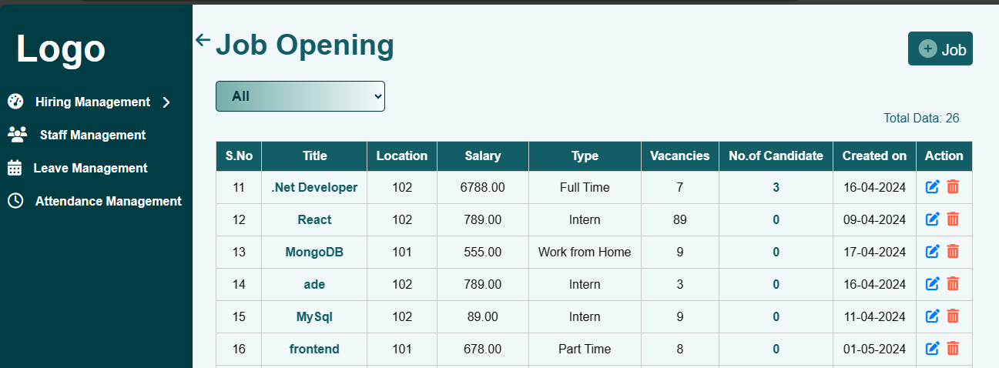
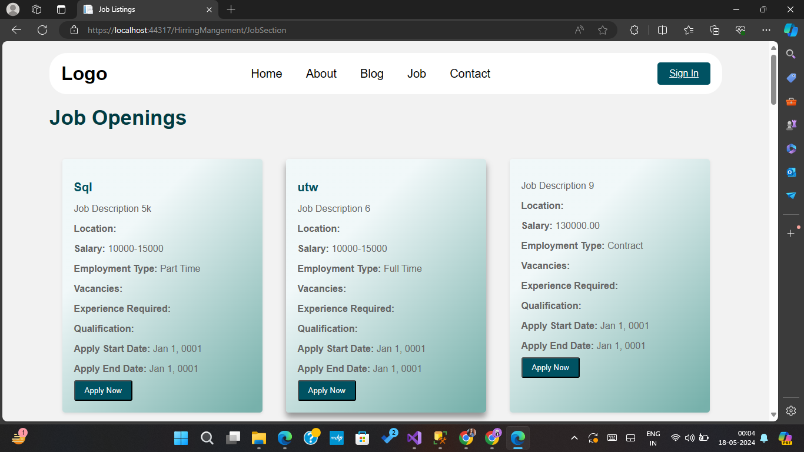
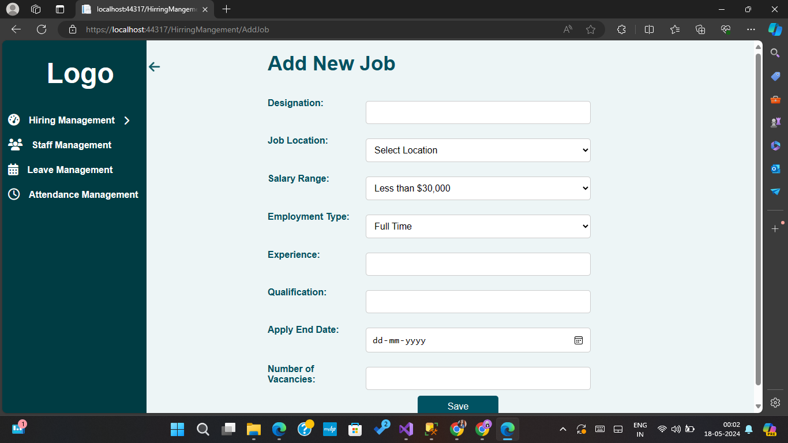
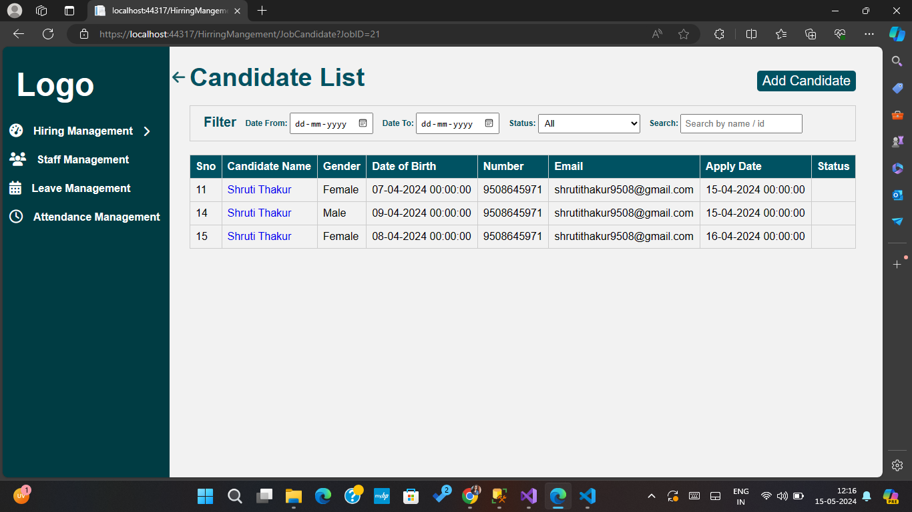
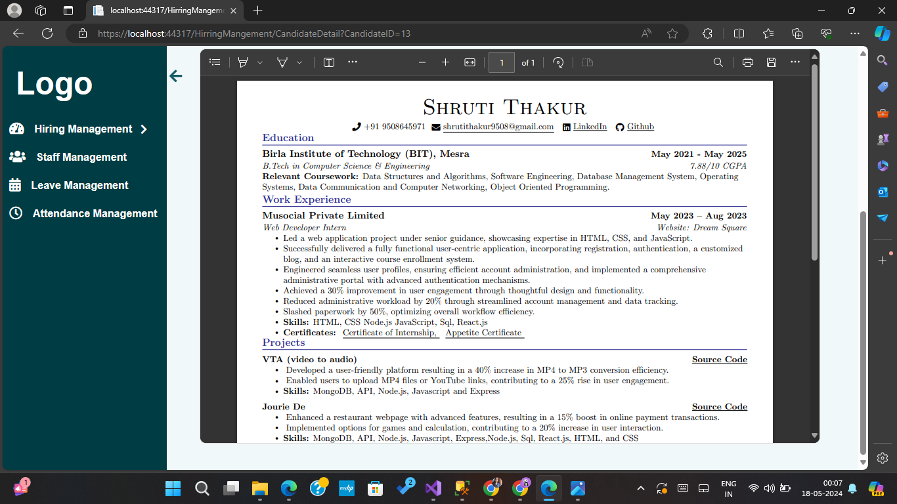
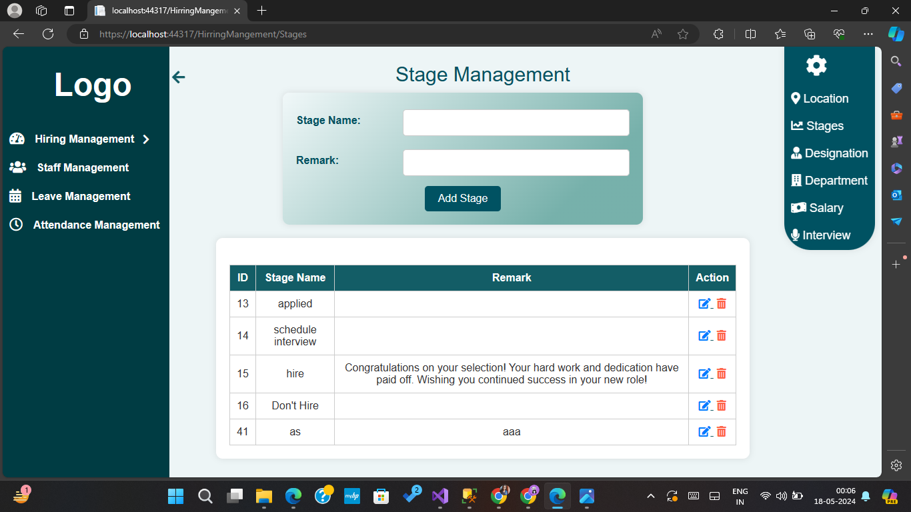

# HR Management System

The HR Management System is a web application designed to streamline the hiring process, manage candidates, and facilitate HR operations. It includes features for job posting, candidate application, resume viewing, interview scheduling, and email notifications.

## Features

- **Job Posting**: Easily manage job openings and reach a wider pool of candidates.
- **Candidate Application**: Candidates can apply for jobs through the platform.
- **Candidate Management**: View detailed candidate profiles, including resumes and personal information.
- **Interview Scheduling**: Automate interview scheduling with confirmations and reminders.
- **Email Notifications**: Notify candidates and HR personnel via email throughout the hiring process.
- **Filtering and Sorting**: Advanced filters allow employers to shortlist candidates based on specific criteria.
- **Setup Page**: Configure stages, salaries, locations, and other settings as per your organization's needs.

## Technologies Used

- **Frontend**: HTML, CSS, Bootstrap, JavaScript
- **Backend**: c#
- **Database**: MySQL
- **Other Tools**: GitHub for version control, VS19 Code as the IDE

## Screenshots

*Job Posting Page*

*Add Job*

*Candidate List Page*

*Resume Preview Page*

*Set Up Page*

